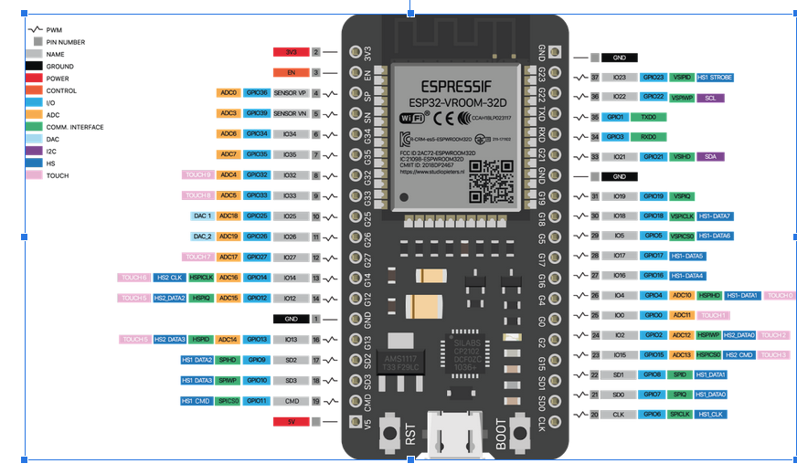

# WiFi WEB SERVER

Esiste la possibilità di impostare il modulo come un server WEB HTTP in ascolto sulla porta TCP 80 

### Attivazione modulo WiFi

La prima cosa da fare è includere la libreria di gestione del modulo WiFi del Chip ESP32

      #include <WiFi.h>

Da questo momento possiamo lavorare sul modulo WiFi del chip tramite la classe WiFi. 

### Libreria di gestione di un server WEB HTTP

Bisogna includere il codice che permette di instanziare, impostare, attivare un server WEB di tipo HTTP 

      #include <WebServer.h>

Da questo momento abbiamo a disposizione la classe WebServer.

### Impostazioni iniziali

Si instanzia un servizio di tipo WebServer in ascolto sulla porta 80:  

      WebServer server(80);

Il server per il momento tuttavia è inattivo. 

Si imposta l'indirizzo IP del server:

      IPAddress local_ip(192, 168, 1, 10);

Si imposta la maschera di sottorete:

      IPAddress subnet(255, 255, 255, 0);

Si imposta il gateway di riferimento:

      IPAddress gateway(192, 168, 1, 10);

### Connessione al server

Qualsiasi dispositivo WIFI con un browser WEB (PC/Tablet/Cellullare con Chrome o affini) o dispositivo con software client HTTP può collegarsi al server HTTP dell'esp32. Ricevuta la pagina HTML sarà possibile interagire con il modulo esp32

### Rilevazione remota della temperatura

Si dichiara la variabile che conterrà il dato di temperatura aggiornato 

      float millivolt;

## ADC converter

ESP32 integra due moduli di conversione analogico digitale a 12-bit di tipo ad approssimazioni successive SAR con 18 canali di acquisizione. Di seguito si riportano i piedini collegabili al modulo ADC numero 1: 

      ADC1_CH0 (GPIO 36)
      ADC1_CH1 (GPIO 37)
      ADC1_CH2 (GPIO 38)
      ADC1_CH3 (GPIO 39)
      ADC1_CH4 (GPIO 32)
      ADC1_CH5 (GPIO 33)
      ADC1_CH6 (GPIO 34)
      ADC1_CH7 (GPIO 35)

L'ADC numero 2 non può essere utilizzato quando è attivo il modulo WiFi ossia nessuno dei seguenti piedini:

      ADC2_CH0 (GPIO 4)
      ADC2_CH1 (GPIO 0)
      ADC2_CH2 (GPIO 2)
      ADC2_CH3 (GPIO 15)
      ADC2_CH4 (GPIO 13)
      ADC2_CH5 (GPIO 12)
      ADC2_CH6 (GPIO 14)
      ADC2_CH7 (GPIO 27)
      ADC2_CH8 (GPIO 25)
      ADC2_CH9 (GPIO 26)

Utilizzare il canale 6 (pin GPIO 34) dell'ADC1 ponendo all'inizio del programma:

      const int ADC1_CH6 = 34;

## Simulazione del sensore tramite potenziometro 

Inizialmente si simula il sensore tramite un potenziometro collegato tra GND e 3.3V. Il piedino centrale del potenziometro si collega sul GPIO di acquisizione:

## Setup

Si attiva la porta seriale di comunicazione per il debug dell'applicazione:

      Serial.begin(9600);

Si registrano le funzioni da richiamare per ogni evento di interesse che il server deve gestire nell'interazione con il client:  

      server.on("/", handle_OnConnect);
      server.onNotFound(handle_NotFound);

Si attiva l'access point:

      Serial.println("Connecting to ");
      Serial.println(WIFI_SSID);

      WiFi.softAP(SSID, PASSWORD);
      WiFi.softAPConfig(local_ip, gateway, subnet);
      delay(100);

Si attiva il server:

      server.begin();
      Serial.println("HTTP server started");

## Loop

Ciclicamente si controlla se ci sono nuovi client connessi:

      server.handleClient();

## Funzioni di gestione eventi

Ad ogni evento che modifica lo stato delle cose aggiorno la pagina HTML e la invio al client:
    
      void handle_OnConnect() {

      int num = analogRead(ADC1_CH6); // Gets the ddp values on pin 34
      millivolt = (num/4095.0)*3300;
      server.send(200, "text/html", SendHTML(Temperature)); 
      }

Ad ogni interrogazione del client invio il valore aggiornato del sensore di temperatura. 

      void handle_NotFound() {
      server.send(404, "text/plain", "Not found");
      }

Qualsiasi altra richiesta che non sia quella della pagina index restiutisce un messaggio "not found" con codice HTTP 404 

## Aggiornamento della pagina HTML e invio al client 

      String SendHTML(float millivolt){
      String ptr = "<!DOCTYPE html> <html>\n";
      ptr +="<head><meta name=\"viewport\" content=\"width=device-width, initial-scale=1.0, user-scalable=no\">\n";
      ptr +="<title>ESP32 Sensor Report</title>\n";
      ptr +="\n";
      ptr +="</head>\n";
      ptr +="<body>\n";
      ptr +="
\n";
      ptr +="<h1>ESP32 temperature sensor data</h1>\n";
      ptr +="
Tensione: ";
      ptr +=String(millivolt);
      ptr +="&deg;C
";  
      ptr +="
\n";
      ptr +="</body>\n";
      ptr +="</html>\n";
      return ptr;
      }
