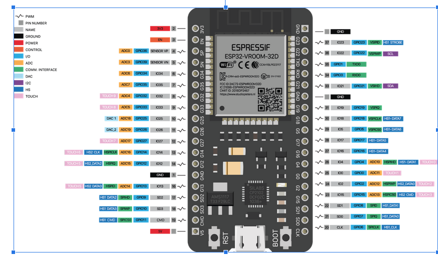

## ESP32 e Modulo I2C  

Il modulo I2C dell' ESP32 può essere collegato al BUS tramite due piedini digitali di default: 

      SDA (GPIO 21)
      SCL (GPIO 22)
      
come si vede dal pinout in figura.

## Collegamento del Modulo I2C  

Il modulo I2C deve essere collegato al bus I2C dell'esp32 come mostrato in figura:

## Inclusione librerie

Si include la libreria di gestione del modulo I2C 

      #include <Wire.h> 
      
e la libreria di gestione del modulo tmp102:

      #include <SparkFunTMP102.h> // Used to send and recieve specific information from our sensor

Da questo momento in poi possiamo creare un oggetto di tipo TMP102:

      TMP102 sensor;
      
## Fase di Setup 

 Si attiva il modulo di comunicazione I2C con impostazioni di default:
 
      Wire.begin(); 
 
 Si inizializza il sensore tmp102 controllando se risponde sull'indirizzo 72 (0x48) di default:
  
      if(!sensor.begin())
      {
            Serial.println("Il TMP102 non risponde.");
            Serial.println("Controllare la connessione al bus I2C. STOP ESECUZIONE.");
            while(1); 
      }
  
Non dovesse rispondere il programma si blocca.

## Fase di loop

Ad ogni interrogazione viene attivata l'acquisizione della temperatura:     
      
      sensor.wakeup();

Poi si interroga per trasferire il dato a 12 bit:

      float temperatura = sensor.readTempC();

Si fermano le conversioni interne:

      sensor.sleep();

Si stampa sul monitor seriale:

       
      Serial.print("Temperatura: ");
      Serial.print(temperatura);
      
Si ferma tutto per un secondo:

       delay(1000);
            
